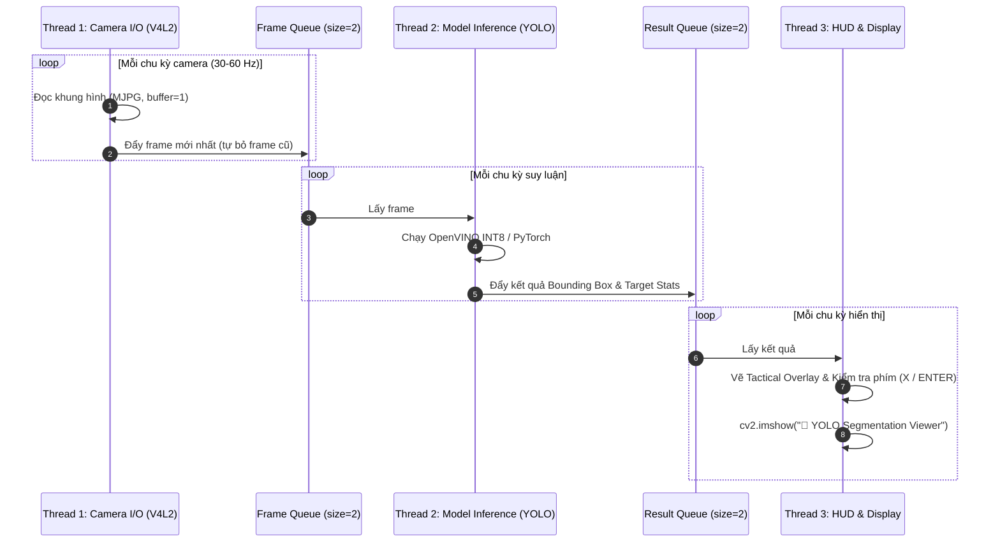

# ⚡ Module YOLOv8: Thị Giác Máy Tính Nhúng Đa Luồng (Embedded Vision & Tracking)

Thư mục `AI-6/YOLOv8/` là hệ thống thị giác máy tính được tái cấu trúc hoàn chỉnh theo kiến trúc module hóa hướng sản xuất (Production-Ready). Module này được tối ưu hóa chuyên biệt để đạt tốc độ khung hình cao (25–30+ FPS) trên phần cứng nhúng **Raspberry Pi 5** kết hợp card gia tốc **AI HAT KIT 26TOPS (Hailo-8 / Hailo-8L NPU)** hoặc **Intel OpenVINO (CPU INT8)**.

---

## 📑 Danh Sách Tệp Tin

| Tệp tin                                                                            | Chức năng chính                                                                                                 |
| :---------------------------------------------------------------------------------- | :----------------------------------------------------------------------------------------------------------------- |
| [**`main.py`**](file:///d:/AI/AI-6/YOLOv8/main.py)                           | Điểm khởi chạy chính: khởi tạo cấu hình, nhận diện phần cứng, nạp model và bắt đầu pipeline.     |
| [**`video_processor.py`**](file:///d:/AI/AI-6/YOLOv8/video_processor.py)     | Kiến trúc **Pipeline 3 Luồng Song Song (3-Thread Decoupled Pipeline)** triệt tiêu độ trễ I/O.       |
| [**`targeting_overlay.py`**](file:///d:/AI/AI-6/YOLOv8/targeting_overlay.py) | Giao diện HUD ngắm bắn chiến thuật, tính toán sai số pixel và cơ chế khóa mục tiêu (Lock-on).        |
| [**`hardware.py`**](file:///d:/AI/AI-6/YOLOv8/hardware.py)                   | Tự động nhận diện bo mạch Pi 5, card Hailo NPU, dung lượng RAM và ghi đè cấu hình tối ưu.           |
| [**`config.py`**](file:///d:/AI/AI-6/YOLOv8/config.py)                       | Trung tâm quản lý toàn bộ tham số: ngưỡng nhận diện, tracker, kích thước ảnh, OpenVINO, v.v.         |
| [**`frame_processor.py`**](file:///d:/AI/AI-6/YOLOv8/frame_processor.py)     | Xử lý suy luận trên từng khung hình, bỏ qua khung hình (Frame Skipping) và gọi vẽ HUD.                  |
| [**`beachmark.py`**](file:///d:/AI/AI-6/YOLOv8/beachmark.py)                 | Công cụ phân rã độ trễ chi tiết từng khâu xử lý và giám sát nhiệt độ/xung nhịp Pi 5.            |
| [**`perf_monitor.py`**](file:///d:/AI/AI-6/YOLOv8/perf_monitor.py)           | Đo đạc thời gian tiền xử lý, suy luận, hậu xử lý và tự động thu gom rác bộ nhớ (`gc.collect`). |
| [**`logger.py`**](file:///d:/AI/AI-6/YOLOv8/logger.py)                       | Hệ thống ghi log đa luồng, hỗ trợ xuất file log có timestamp với chuẩn mã hóa UTF-8.                   |
| [**`utils.py`**](file:///d:/AI/AI-6/YOLOv8/utils.py)                         | Các hàm phụ trợ: thuật toán gán Hungary, IoU, kiểm tra bộ lọc Kalman.                                    |

---

## 🧵 Kiến Trúc Pipeline 3 Luồng Song Song (3-Thread Pipeline)

Để đảm bảo camera không bị trễ khung hình khi model đang bận suy luận, [**`video_processor.py`**](file:///d:/AI/AI-6/YOLOv8/video_processor.py) phân tách thành 3 luồng hoạt động bất đồng bộ qua các hàng đợi dung lượng nhỏ (`Queue(maxsize=2)`):



---

## 🎯 Giao Diện HUD Chiến Thuật & Cơ Chế Khóa Mục Tiêu (`targeting_overlay.py`)

Giao diện hiển thị các thông số ngắm bắn quân sự:

```plaintext
+-------------------------------------------------------------+
|  FPS: 28.5  |  DET: 1  |  TEMP: 54.2°C                      |
|                                                             |
|                   [ TARGET STRIKE ZONE ]                    |
|             +---------------------------------+             |
|             |                                 |             |
|             |          🎯 Object              |             |
|             |          |                      |             |
|             |          v (Offset: dx, dy)     |             |
|             |          + [Center Crosshair]   |             |
|             |                                 |             |
|             +---------------------------------+             |
|                                                             |
|                 ** LOCKED ** (Target ID: 1)                 |
|                   Press ENTER to release                    |
+-------------------------------------------------------------+
```

### Các trạng thái khóa mục tiêu:

1. **Tìm kiếm (Seeking)**: Vẽ khung *Target Strike Zone* (hình chữ nhật màu tím ở trung tâm). Vẽ tia nối từ tâm mục tiêu đến tâm khung hình và hiển thị độ lệch pixel (`L/R`, `U/D`).
2. **Trong vùng khóa (`_in_range`)**: Khi khoảng cách từ tâm đối tượng đến tâm khung hình nhỏ hơn `LOCK_RADIUS_PX = 40` pixel.
3. **Xác nhận khóa (`_is_locked`)**:
   * Người dùng nhấn phím `X` trên bàn phím (hoặc gạt switch `SB` từ tay cầm).
   * Tâm ngắm chuyển sang chữ thập đỏ, hiện cảnh báo `** LOCKED **` cùng định danh đối tượng (`_locked_tid`).
4. **Hủy khóa**: Nhấn phím `ENTER` để đưa hệ thống về trạng thái tìm kiếm ban đầu.

---

## 🍓 Tự Động Thích Ứng Phần Cứng (`hardware.py`)

Hệ thống tự động phát hiện cấu hình phần cứng khi khởi động và áp dụng các cấu hình tối ưu:

| Phần cứng phát hiện             | Backend tối ưu        | Kích thước ảnh (`IMGSZ`) | Giới hạn phát hiện (`MAX_DET`) |           Bộ lọc nâng cao           |      FPS dự kiến      |
| :---------------------------------- | :---------------------- | :----------------------------: | :----------------------------------: | :------------------------------------: | :---------------------: |
| **Pi 5 + AI HAT (Hailo NPU)** | HailoRT / ONNX          |          `640x640`          |                  20                  |           ByteTrack + Kalman           | **20 – 30+ FPS** |
| **Pi 5 CPU (Không có NPU)** | OpenVINO INT8           |          `512x512`          |                  10                  |       Bỏ Kalman, Frame Skip N=2       | **15 – 22 FPS** |
| **Pi 5 RAM thấp (< 4GB)**    | OpenVINO INT8           |          `480x480`          |                  10                  |        Dọn RAM mỗi 50 frames        | **12 – 18 FPS** |
| **PC / Laptop (GPU NVIDIA)**  | PyTorch CUDA / TensorRT |         `640 – 832`         |                  50                  | Bật đầy đủ (Kalman + Multi-scale) | **45 – 90+ FPS** |

---

## 🚀 Hướng Dẫn Vận Hành

### 1. Cài đặt môi trường trên Raspberry Pi 5

```bash
# Cài đặt các gói phụ thuộc
pip install ultralytics opencv-python numpy openvino

# Kiểm tra tương thích camera V4L2
v4l2-ctl --list-devices
```

### 2. Kiểm tra xung nhịp và phân rã độ trễ (Benchmark)

```bash
python beachmark.py
```

Lệnh này sẽ chạy kiểm thử 30 lần để tính toán chi tiết: thời gian suy luận thuần (`inf_ms`), thời gian giải nén hộp (`unpack_ms`), thời gian thay đổi kích thước khung hình (`resize_ms`), và kiểm tra tần số xung nhịp CPU hiện tại.

### 3. Khởi chạy hệ thống nhận diện & ngắm bắn

```bash
# Sử dụng cấu hình mặc định (chạy camera /dev/video0 hoặc video có sẵn)
python main.py
```

### 4. Các phím tắt tương tác:

* `X`: Khóa mục tiêu (khi mục tiêu ở gần tâm ngắm).
* `ENTER`: Hủy khóa mục tiêu.
* `Q` hoặc `ESC`: Thoát chương trình.
