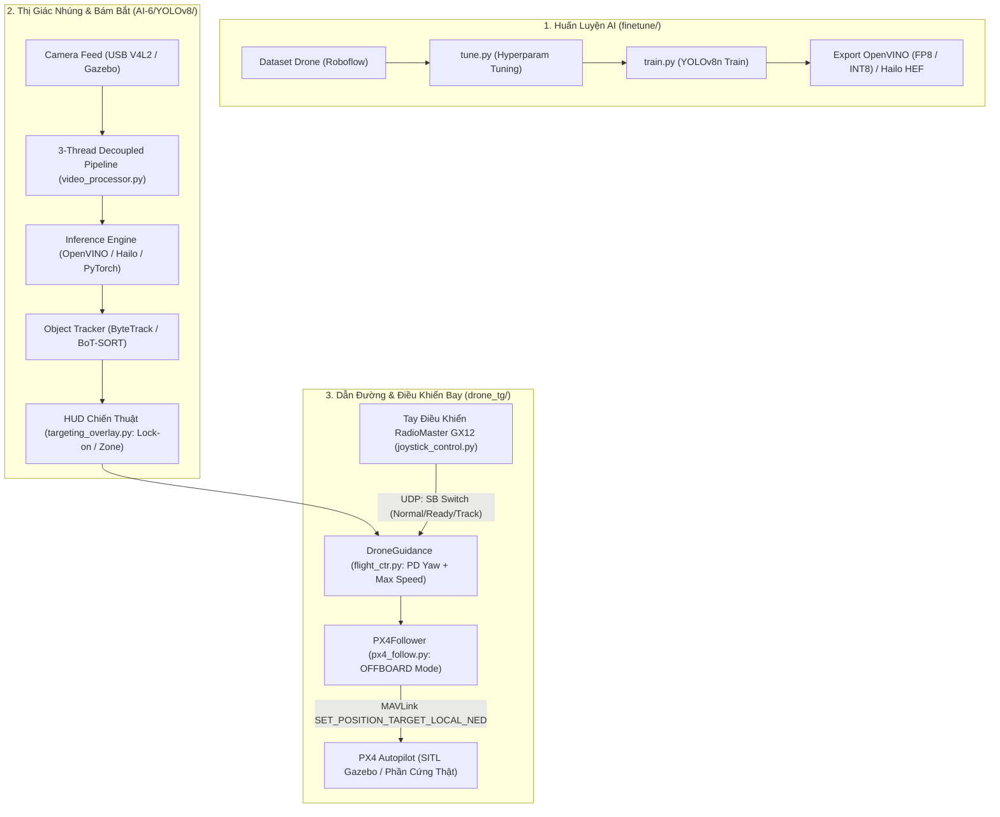

# 🎯 Drone-suicide: Hệ Thống UAV Tự Hành Đánh Chặn & Bám Bắt Mục Tiêu

Dự án phát triển hệ thống điều khiển bay và thị giác máy tính tích hợp dành cho **UAV tự hành đánh chặn / bám đuổi mục tiêu (Interceptor / Kamikaze / Target-Tracking Drone)**. Hệ thống kết hợp giữa mô hình Deep Learning nhận diện mục tiêu thời gian thực, thuật toán dẫn đường động học bám đuổi tốc độ cao, và giao tiếp điều khiển tự động qua giao thức MAVLink với **PX4 Autopilot**.

Hệ thống hỗ trợ cả môi trường **mô phỏng vật lý (PX4 SITL + Gazebo Harmonic/Garden)** và triển khai thực tế trên **phần cứng nhúng (Raspberry Pi 5 + AI HAT Hailo-8 NPU / OpenVINO)**.

---

## 📑 Mục Lục
1. [Kiến Trúc Tổng Thể](#-kiến-trúc-tổng-thể)
2. [Cấu Trúc Thư Mục](#-cấu-trúc-thư-mục)
3. [Luồng Hoạt Động (System Pipeline)](#-luồng-hoạt-động-system-pipeline)
4. [Các Tính Năng Trọng Tâm](#-các-tính-năng-trọng-tâm)
5. [Yêu Cầu Hệ Thống & Cài Đặt](#-yêu-cầu-hệ-thống--cài-đặt)
6. [Hướng Dẫn Vận Hành & Khởi Chạy](#-hướng-dẫn-vận-hành--khởi-chạy)
7. [Nguyên Tắc An Toàn Bay (Safety Protocols)](#-nguyên-tắc-an-toàn-bay-safety-protocols)

---

## 🏛 Kiến Trúc Tổng Thể



---

## 📂 Cấu Trúc Thư Mục

```plaintext
d:/AI/
├── README.md               # Tài liệu tổng quan toàn bộ dự án
├── READmetest.md           # Hướng dẫn cấu hình PX4 SITL, Gazebo và tham số bay
│
├── finetune/               # [1] Huấn luyện, tinh chỉnh siêu tham số và tối ưu model AI
│   ├── data.yaml           # Cấu hình dataset nhận diện Drone
│   ├── train.py            # Huấn luyện YOLOv8n với bộ tham số tối ưu
│   ├── tune.py             # Tìm kiếm siêu tham số bằng thuật toán di truyền
│   ├── split_dataset.py    # Phân chia dataset và tiêm ảnh nền (background/negative)
│   ├── create_pic.py       # Tạo nhãn rỗng cho dữ liệu nền
│   ├── test.py             # Đánh giá và kiểm thử mô hình sau huấn luyện
│   └── README.md           # Tài liệu chi tiết module finetune
│
├── AI-6/                   # [2] Bộ xử lý thị giác máy tính thời gian thực cho Pi 5
│   ├── requirements.txt    # Danh sách thư viện cần thiết cho Pi 5 + Hailo
│   ├── UPGRADE_SUMMARY.md  # Báo cáo nâng cấp và tối ưu hóa phần cứng
│   ├── IMPROVEMENTS.md     # Đánh giá hiệu năng và các cải tiến lượng tử hóa
│   ├── weights/            # Chứa trọng số mô hình (PyTorch .pt, OpenVINO IR, INT8)
│   └── YOLOv8/             # Kiến trúc thị giác module hóa đa luồng (Production-ready)
│       ├── main.py         # Điểm khởi chạy chính hệ thống nhận diện
│       ├── video_processor.py # Pipeline 3 luồng song song triệt tiêu độ trễ
│       ├── targeting_overlay.py # Giao diện HUD ngắm bắn và cơ chế khóa mục tiêu (Lock-on)
│       ├── hardware.py     # Tự động nhận diện Pi 5, Hailo NPU, RAM & cấu hình
│       ├── config.py       # Trung tâm cấu hình tham số thị giác
│       ├── beachmark.py    # Phân tích độ trễ chi tiết từng công đoạn xử lý
│       └── README.md       # Tài liệu chi tiết module YOLOv8
│
└── drone_tg/               # [3] Hệ thống dẫn đường, MAVLink và điều khiển bay
    ├── flight_ctr.py       # Bộ não dẫn đường (PD Yaw guidance + Kamikaze acceleration)
    ├── px4_follow.py       # Giao tiếp MAVLink chế độ OFFBOARD với PX4 Autopilot
    ├── tracker_gz.py       # Điều khiển chính trong mô phỏng Gazebo (gz-transport)
    ├── joystick_control.py # Cầu nối tay cầm RadioMaster GX12 sang MAVLink & UDP
    ├── tracker.py          # Bộ bám mẫu hình ảnh (Template Matching)
    ├── test_guide.py       # Giả lập 2D kiểm thử thuật toán dẫn đường PD
    ├── camera_view.py      # Hiển thị camera stream từ Gazebo qua gz-transport
    └── README.md           # Tài liệu chi tiết module drone_tg
```

---

## 🔄 Luồng Hoạt Động (System Pipeline)

1. **Giai đoạn Thu nhận & Xử lý Thị giác**:
   * Camera USB V4L2 (trên drone thật) hoặc `gz-transport` (trên Gazebo) đưa khung hình trực tiếp vào hàng đợi bộ nhớ dùng chung không copy dữ liệu (`buffer=1`).
   * Mô hình YOLOv8n (được lượng tử hóa OpenVINO INT8) phát hiện mục tiêu với tốc độ ổn định 20–30 FPS trên CPU/NPU nhúng.
   * Bộ theo dõi (ByteTrack / Template Match) gán định danh ổn định qua các khung hình.

2. **Giai đoạn Tương tác Phi công & Khóa Mục tiêu**:
   * Phi công quan sát giao diện HUD chiến thuật (`targeting_overlay.py`):
     * **NORMAL**: Bay điều khiển thủ công bằng tay cầm RadioMaster GX12.
     * **READY**: Công tắc `SB` gạt về giữa, bật khung chữ nhật ngắm bắn (*Target Zone*) trung tâm.
     * **TRACKING / LOCK**: Khi mục tiêu lọt vào vòng tròn cho phép (`LOCK_RADIUS_PX = 40`), phi công xác nhận khóa (hoặc gạt `SB` xuống vị trí dưới cùng). Hệ thống kích hoạt trạng thái `** LOCKED **`.

3. **Giai đoạn Dẫn đường Động học (Guidance Phase)**:
   * Thuật toán `DroneGuidance` tính toán sai số vị trí $(err_x, err_y)$ so với tâm camera.
   * Ước lượng vận tốc di chuyển ngang của mục tiêu ($v_x$).
   * Tính toán góc bẻ lái ngang bằng bộ điều khiển PD:
     $$\text{YawRate} = K_p \cdot err_x + K_d \cdot v_x$$
   * Tăng tốc thẳng tối đa ($6.5\text{ m/s}$) hướng vào mục tiêu, kết hợp điều chỉnh trượt ngang ($v_y$) và độ cao ($v_z$) để tâm camera luôn hướng thẳng vào mục tiêu.

4. **Giai đoạn Chấp hành Bay (MAVLink OFFBOARD)**:
   * `px4_follow.py` gửi liên tục các gói tin `SET_POSITION_TARGET_LOCAL_NED` ở tần số 20–50Hz tới PX4 Autopilot để thực thi chuyển động.

---

## ⚡ Các Tính Năng Trọng Tâm

* 🚀 **Pipeline 3 Luồng Song Song (Decoupled Multithreading)**: Camera Capture, Model Inference và HUD Display chạy hoàn toàn độc lập, loại bỏ hiện tượng nghẽn I/O và giật khung hình.
* 🍓 **Tối Ưu Hóa Sâu Cho Phần Cứng Nhúng**: Tự động phát hiện Raspberry Pi 5 và AI HAT Hailo-8 NPU; tự động chuyển sang mô hình OpenVINO INT8 nếu chạy CPU, giảm tải bộ nhớ với chu kỳ dọn RAM tự động.
* 🎯 **Định Luật Dẫn Đường Dự Báo (Predictive PD Guidance)**: Thành phần vi phân $D$ tính toán vận tốc mục tiêu giúp drone bẻ lái đón đầu hướng di chuyển của mục tiêu, khắc phục độ trễ truyền hình ảnh.
* 🎮 **Hỗ Trợ Tay Cầm Vật Lý & Mô Phỏng PX4 SITL**: Kết nối trực tiếp tay cầm RadioMaster GX12 qua MAVLink UDP, chuyển đổi mượt mà giữa chế độ bay tay và bám đuổi tự động.
* 🛡️ **Cơ Chế Pre-stream MAVLink An Toàn**: Phát trước luồng setpoint vận tốc nền trước khi chuyển `OFFBOARD`, đảm bảo PX4 không từ chối chế độ bay hoặc kích hoạt fail-safe đột ngột.

---

## 🛠 Yêu Cầu Hệ Thống & Cài Đặt

### 1. Phần mềm
* Hệ điều hành: Ubuntu 22.04 LTS (khuyến nghị cho ROS 2/Gazebo/PX4) hoặc Windows 11 (kết nối qua WSL2).
* Python 3.10 trở lên.
* PX4-Autopilot (v1.14+) & Gazebo Harmonic / Garden.
* OpenVINO Runtime hoặc HailoRT (nếu sử dụng card AI HAT).

### 2. Cài đặt Dependencies

```bash
# Cài đặt các thư viện Python cơ bản
pip install ultralytics opencv-python numpy pymavlink pygame filterpy scipy

# (Tùy chọn) Cài đặt OpenVINO cho inference tốc độ cao trên CPU
pip install openvino

# Cài đặt thư viện giao tiếp Gazebo (trên Ubuntu / WSL2)
sudo apt-get update
sudo apt-get install python3-gz-transport13 python3-gz-msgs10
```

---

## 🚀 Hướng Dẫn Vận Hành & Khởi Chạy

### 1. Mô Phỏng SITL với Gazebo
```bash
# Bước 1: Khởi chạy mô phỏng PX4 SITL với mô hình x500 có camera đơn
cd ~/PX4-Autopilot
make px4_sitl gz_x500_mono_cam

# Bước 2: Khởi chạy giao tiếp tay cầm (trên Windows hoặc Linux)
python drone_tg/joystick_control.py --target 127.0.0.1:14580 --tracker-ip 127.0.0.1 --tracker-port 5005

# Bước 3: Khởi chạy module bám bắt và dẫn đường mô phỏng
python drone_tg/tracker_gz.py
```

### 2. Triển Khai Thực Tế Trên Drone (Raspberry Pi 5)
```bash
# Bước 1: Kiểm tra phần cứng nhận diện
python AI-6/YOLOv8/beachmark.py

# Bước 2: Chạy hệ thống nhận diện và ngắm bắn thời gian thực
cd AI-6/YOLOv8
python main.py
```

---

## ⚠️ Nguyên Tắc An Toàn Bay (Safety Protocols)

1. **Khóa Công Tắc Khẩn Cấp (Kill Switch / Emergency Disarm)**:
   * Luôn gán nút Disarm hoặc Kill Switch vật lý trên tay cầm RadioMaster (mặc định kênh SA/Button 1).
   * Khi gạt `SB` về vị trí `NORMAL`, hệ thống ngay lập tức thoát chế độ `OFFBOARD` và trao lại toàn quyền điều khiển thủ công cho phi công.
2. **Cơ Chế Khi Mất Dấu Mục Tiêu (LOST Target)**:
   * Nếu mục tiêu bị che khuất hoặc vượt ra ngoài tầm nhìn camera, hệ thống lập tức ngắt lệnh tăng tốc cảm tử và đưa vận tốc tiến về `0.0 m/s` để tránh đâm mù quáng.
3. **Môi Trường Bay Thử Nghiệm**:
   * Luôn thực hiện thử nghiệm trên mô phỏng Gazebo và kiểm tra phản ứng của bộ điều khiển PD trên trình giả lập `test_guide.py` trước khi nạp vào drone thực tế.
