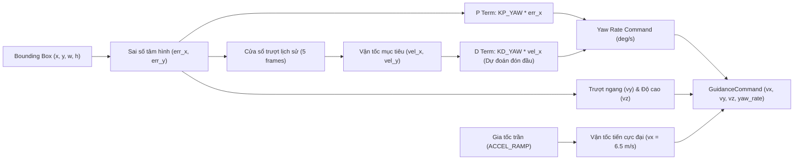

# 🚀 Module Drone-TG: Dẫn Đường Động Học & Điều Khiển Bay (Guidance & PX4 Autopilot)

Thư mục `drone_tg/` là trung tâm điều khiển bay và dẫn đường động học của hệ thống UAV. Module này chịu trách nhiệm biến đổi tọa độ bám bắt mục tiêu từ camera thành các lệnh bay vận tốc thực tế (Velocity Vector & Yaw Rate), giao tiếp trực tiếp với **PX4 Autopilot** qua giao thức MAVLink (chế độ `OFFBOARD`), và tích hợp môi trường mô phỏng **Gazebo** cùng tay điều khiển từ xa vật lý **RadioMaster GX12**. Nếu dùng window thì cài đặt wsl và bỏ hết toàn bộ file vào wsl loại trừ joystick_follow.py để kết nối với tay cầm.

---

## 📑 Danh Sách Tệp Tin

| Tệp tin                                                                                                                                          | Chức năng chính                                                                                                                                                 |
| :------------------------------------------------------------------------------------------------------------------------------------------------ | :----------------------------------------------------------------------------------------------------------------------------------------------------------------- |
| [**`flight_ctr.py`**](file:///d:/AI/drone_tg/flight_ctr.py)                                                                                | **Bộ não dẫn đường (`DroneGuidance`)**: Tính toán sai số lệch tâm, ước lượng vận tốc mục tiêu và bộ điều khiển góc quay ngang PD. |
| [**`px4_follow.py`**](file:///d:/AI/drone_tg/px4_follow.py)                                                                                | **Cầu nối MAVLink (`PX4Follower`)**: Quản lý kết nối, gửi trước setpoint nền (Pre-stream) và điều khiển chế độ `OFFBOARD`.              |
| [**`tracker_gz.py`**](file:///d:/AI/drone_tg/tracker_gz.py)                                                                                | Điểm kết nối trung tâm trong môi trường mô phỏng Gazebo (`gz-transport13` + protoc stream + UDP listener).                                             |
| [**`joystick_control.py`**](file:///d:/AI/drone_tg/joystick_control.py)                                                                    | Đọc tín hiệu cần lái & công tắc từ tay cầm**RadioMaster GX12** qua `pygame`, gửi MAVLink và UDP.                                               |
| [**`tracker.py`**](file:///d:/AI/drone_tg/tracker.py)                                                                                      | Bộ bám mẫu hình ảnh (`LogicTracker`) sử dụng thuật toán khớp mẫu chuẩn hóa (Normalized Cross-Correlation).                                          |
| [**`test_guide.py`**](file:///d:/AI/drone_tg/test_guide.py)                                                                                | Trình giả lập thị giác 2D trực quan giúp kiểm thử và căn chỉnh các hệ số PID mà không cần drone thật.                                           |
| [**`camera_view.py`**](file:///d:/AI/drone_tg/camera_view.py)                                                                              | Script độc lập kiểm tra và hiển thị luồng hình ảnh từ camera mô phỏng Gazebo.                                                                         |
| [**`test_mavlink.py`**](file:///d:/AI/drone_tg/test_mavlink.py) & [**`test_offboard.py`**](file:///d:/AI/drone_tg/test_offboard.py) | Script kiểm thử kết nối cổng MAVLink UDP và chế độ OFFBOARD.                                                                                              |

---

## 📐 Thuật Toán Dẫn Đường Động Học (`flight_ctr.py`)

Hệ thống sử dụng chiến thuật dẫn đường tấn công cảm tử / đánh chặn (Kamikaze Interceptor Guidance):



### 1. Tính toán sai số vị trí (Frame-centre Error)

Tâm của mục tiêu $(c_x, c_y)$ so với tâm khung hình $(w/2, h/2)$:

$$
\text{err}_x = c_x - \frac{w}{2}, \quad \text{err}_y = c_y - \frac{h}{2}
$$

### 2. Ước lượng vận tốc di chuyển của mục tiêu (Target Velocity Estimation)

Sử dụng cửa sổ trượt 5 frame gần nhất (`VEL_SMOOTH_FRAMES = 5`) kết hợp thời gian thực tế (`perf_counter`) để tính vận tốc góc nhìn:

$$
v_x = \frac{\text{err}_x(t) - \text{err}_x(t - \Delta t)}{\Delta t} \quad (\text{pixel/s})
$$

### 3. Bộ điều khiển góc quay ngang PD (Proportional-Derivative Yaw Control)

Nhằm bẻ lái mũi drone luôn hướng đón đầu mục tiêu đang bay:

$$
\text{YawRate} = K_p \cdot \text{err}_x + K_d \cdot v_x
$$

* **Hệ số tỉ lệ ($K_p = 0.03$)**: Bẻ lái tỷ lệ thuận theo vị trí lệch tâm hiện tại.
* **Hệ số vi phân dự báo ($K_d = 0.01$)**: Tính toán trước hướng di chuyển của mục tiêu để chủ động quay mũi drone đón đầu.
* **Vùng chết (`YAW_DEADZONE_PX = 20` px)**: Triệt tiêu các dao động nhỏ quanh tâm để tránh hiện tượng rung giật con quay (Gyro jitter).
* **Giới hạn vật lý**: Giới hạn tốc độ quay tối đa ở `MAX_YAW_RATE = 25.0` deg/s.

### 4. Chiến thuật tăng tốc đánh chặn (Speed Scheduling)

* Khác với drone giám sát dân dụng (thường giảm tốc độ khi đến gần mục tiêu), hệ thống này duy trì vận tốc tiến cực đại `MAX_SPEED = 6.5 m/s`.
* Tốc độ được tăng dần đều theo dốc gia tốc an toàn `ACCEL_RAMP = 2.0 m/s²` để tránh giật dòng pin hoặc mất ổn định con quay hồi chuyển.
* Tự động hiệu chỉnh trượt ngang ($v_y = K_{\text{lat}} \cdot \text{err}_x$) và nâng hạ độ cao ($v_z = -K_{\text{vert}} \cdot \text{err}_y$) nhằm giữ mục tiêu luôn ở trung tâm trục quang học.

---

## 📡 Giao Tiếp MAVLink Chế Độ OFFBOARD (`px4_follow.py`)

PX4 yêu cầu điều kiện khắt khe để kích hoạt và duy trì chế độ `OFFBOARD`. Lớp `PX4Follower` được thiết kế các giải pháp kỹ thuật an toàn:

1. **Cơ chế Pre-stream Setpoint Nền**:
   * Ngay khi khởi tạo `PX4Follower`, phương thức [`start_prestream()`](file:///d:/AI/drone_tg/px4_follow.py#L39-L63) được kích hoạt trong một background thread để liên tục gửi các lệnh vận tốc $0$ ở tần số 20Hz.
   * Khi phi công chuyển công tắc sang chế độ bám mục tiêu, PX4 đã nhận đủ setpoint trước đó và chấp thuận lệnh chuyển chế độ `MAV_CMD_DO_SET_MODE` ngay lập tức mà không rơi vào trạng thái Fail-Safe.
2. **Khung tọa độ thân máy bay (`MAV_FRAME_BODY_NED`)**:
   * Lệnh vận tốc được gửi qua tin nhắn `SET_POSITION_TARGET_LOCAL_NED`:
     * $v_x$: Vận tốc tiến tới trước theo trục thân máy bay.
     * $v_y$: Vận tốc trượt ngang sang phải/trái.
     * $v_z$: Vận tốc nâng hạ độ cao.
     * $\dot{\psi}$: Tốc độ quay quanh trục thẳng đứng (Yaw rate theo radian/s).

---

## 🎮 Tích Hợp Tay Cầm Điều Khiển RadioMaster GX12 (`joystick_control.py`)

Hệ thống kết nối tay cầm điều khiển từ xa chuẩn FPV qua USB (Direct Joystick Input):

* **Các kênh điều khiển chính**: Roll (Trục 0), Pitch (Trục 1), Throttle (Trục 2), Yaw (Trục 3).
* **Công tắc chuyển trạng thái thông minh — Switch SB (Trục 5)**:
  * **Vị trí trên (`SB < -0.5`) — Chế độ NORMAL**: Drone ở chế độ bay thủ công, thuật toán AI tắt hoàn toàn.
  * **Vị trí giữa (`-0.5 <= SB < 0.3`) — Chế độ READY**: Bật khung ngắm trung tâm trên màn hình HUD, sẵn sàng khóa khi mục tiêu đi vào vùng ngắm.
  * **Vị trí dưới (`SB >= 0.7`) — Chế độ TRACKING**: Tự động chuyển PX4 sang chế độ OFFBOARD, kích hoạt thuật toán dẫn đường lao vào mục tiêu.
* Trạng thái công tắc được phát thanh qua socket UDP (cổng `5005`) tới [**`tracker_gz.py`**](file:///d:/AI/drone_tg/tracker_gz.py) với độ trễ dưới 2ms.

---

## 🐧 Cài Đặt Môi Trường Ubuntu 24.04 LTS & Gazebo Harmonic

Môi trường mô phỏng của hệ thống `drone_tg` sử dụng **Gazebo Harmonic (Gz Sim v8)** kết hợp với **PX4 Autopilot SITL**. Gazebo Harmonic là phiên bản LTS tiêu chuẩn hiện đại, tương thích hoàn hảo với **Ubuntu 24.04 LTS (Noble Numbat)** và cung cấp giao thức truyền dữ liệu camera tốc độ cao qua `gz-transport13` cùng protobuf `gz-msgs10`.

> [!NOTE]
> *Ubuntu 24.04 LTS* là phiên bản được khuyến nghị chính thức. Bạn có thể cài đặt trực tiếp trên máy vật lý (Dual Boot) hoặc cài đặt nhanh qua **WSL2 (Windows Subsystem for Linux)** ngay trên Windows 10/11.

---

### 1. Cài Đặt Ubuntu 24.04 LTS

#### Cài đặt qua WSL2 trên Windows

1. Mở **PowerShell** bằng quyền Administrator (`Run as Administrator`):
   ```powershell
   # Liệt kê các bản phân phối Linux khả dụng
   # Cài đặt Ubuntu 24.04 LTS
   wsl --install -d Ubuntu-24.04
   ```
2. Khởi động lại máy tính nếu Windows yêu cầu. Sau đó mở ứng dụng **Ubuntu 24.04** từ Start Menu để thiết lập `Username` và `Password`.
3. Kiểm tra thông tin phiên bản trong terminal Ubuntu:
   ```bash
   lsb_release -a
   # Description: Ubuntu 24.04 LTS (noble)
   ```

### 2. Cài Đặt Gazebo Harmonic & Thư Viện Giao Tiếp (`gz-transport13`)

Thực hiện các lệnh sau bên trong môi trường terminal **Ubuntu 24.04**:

```bash
# Bước 1: Cập nhật hệ thống và cài đặt công cụ cần thiết
sudo apt update && sudo apt upgrade -y
```

---

### 3. Cài Đặt & Cấu Hình PX4 SITL Với Gazebo Harmonic

```bash
# 1. Clone mã nguồn PX4-Autopilot kèm các submodule liên quan
git clone https://github.com/PX4/PX4-Autopilot.git --recursive ~/PX4-Autopilot
cd ~/PX4-Autopilot

# 2. Cài đặt các gói phụ thuộc tự động của PX4 trên Ubuntu 24.04
bash ./Tools/setup/ubuntu.sh

# 3. Khởi động lại terminal hoặc đăng xuất để nạp cấu hình nhóm người dùng
```

#### Tối ưu hóa card đồ họa & biến môi trường (Đặc biệt trên WSL2):

Mở file cấu hình shell `~/.bashrc`:

```bash
nano ~/.bashrc
```

Dán các dòng sau vào cuối tệp:

```bash
# Bật tăng tốc phần cứng GPU NVIDIA / D3D12 qua WSLg
export LIBGL_ALWAYS_SOFTWARE=0
export MESA_D3D12_DEFAULT_ADAPTER_NAME=NVIDIA
export GALLIUM_DRIVER=d3d12

# Loại bỏ các đường dẫn /mnt/c/ khỏi PATH để tránh xung đột binary giữa Windows và Linux
export PATH=$(echo $PATH | tr ':' '\n' | grep -v '/mnt/c/' | tr '\n' ':')
```

Lưu lại (`Ctrl + O`, `Enter`, `Ctrl + X`) rồi nạp lại cấu hình:

```bash
source ~/.bashrc
```

#### Các tham số PX4 khuyến nghị cho mô phỏng bay bám bắt:

Sau khi khởi chạy lệnh `make px4_sitl gz_x500_mono_cam`, trong terminal điều khiển `px4>` (hoặc `pxh>`), hãy thiết lập:

```text
# Cho phép cất cánh mà không cần GPS
param set COM_ARM_WO_GPS 1

# Cho phép nhận tín hiệu điều khiển từ MAVLink (chế độ MavLinkOnly)
param set COM_RC_IN_MODE 1

# Bỏ qua kiểm tra an toàn nghiêm ngặt khi bay thử nghiệm
param set COM_ARM_CHK_EN 0

# Tối đa hóa tốc độ đáp ứng góc quay (deg/s) cho cơ động đuổi bắt
param set MC_ROLLRATE_MAX 720
param set MC_PITCHRATE_MAX 720
param set MC_YAWRATE_MAX 540

# Lưu các tham số vừa cấu hình
param save
```

#### Cài đặt thư viện để sử dụng camera từ px4:

```bash
pip install gz-transport13 gz-msgs10
```

---

### 4. Kiểm Thử Luồng Camera Từ Gazebo Harmonic

1. Khởi chạy PX4 SITL kèm mô hình drone x500 có gắn camera đơn sắc:

   ```bash
   cd ~/PX4-Autopilot
   make px4_sitl gz_x500_mono_cam
   ```
2. Mở một terminal Ubuntu mới, kiểm tra topic camera được publish:

   ```bash
   gz topic -l | grep camera
   ```

   Topic hình ảnh mặc định là:

   ```text
   /world/default/model/x500_mono_cam_0/link/camera_link/sensor/camera/image
   ```
3. Chạy script [**`camera_view.py`**](file:///d:/AI/drone_tg/camera_view.py) để kiểm tra luồng video trực quan từ Gazebo:

   ```bash
   python3 camera_view.py
   ```

---

## 🚀 Hướng Dẫn Vận Hành & Thử Nghiệm

### Chạy toàn bộ hệ thống với mô phỏng PX4 SITL & Gazebo

```bash
# Bước 1: Khởi chạy PX4 SITL với mô hình x500 có camera (trong terminal Linux/WSL)
make px4_sitl gz_x500_mono_cam

# Bước 2: Bật giao tiếp tay cầm RadioMaster GX12 (trên máy chủ Windows/Linux)
python joystick_control.py --target 127.0.0.1:14580 --tracker-ip 127.0.0.1 --tracker-port 5005

# Bước 3: Khởi chạy vòng lặp bám bắt và dẫn đường mô phỏng
python tracker_gz.py
```

Trên giao diện cửa sổ `Frame`, quan sát màn hình camera thu từ Gazebo, gạt công tắc `SB` trên tay cầm để trải nghiệm quá trình khóa mục tiêu và dẫn đường tự động.
